# 🚀 End-to-End Data Engineering: Incremental ETL Lab with Azure Databricks

This repository provides a hands-on guide to mastering **Incremental Data Ingestion** and transformation using **Azure Databricks**, **ADLS Gen2**, and the **Medallion Architecture**.

---

## 🏗️ Project Architecture
This diagram illustrates the end-to-end data pipeline from source ingestion to final reporting.


---

## 📋 Prerequisites
Ensure you have the following ready before starting:

* **Azure Account:** An active subscription is required.
    > [!IMPORTANT]
    > **Free Trial vs. Pay-As-You-Go:** > New accounts get $200 credit for 30 days. After 30 days, Azure disables the subscription to prevent accidental charges. To continue, you must **Upgrade to Pay-As-You-Go**. You will still have access to free services for 12 months, but you only get charged for usage beyond the free limits.

* **💰 Financial Safety (Preventing Bills):** If your subscription was disabled or you have upgraded, it is **critical** to set a **Budget Alert** to avoid unexpected costs. While budgets don't stop services automatically, they provide crucial oversight.
    
    **Steps to Set a 1.00 € Budget:**
    1. Navigate to **Cost Management + Billing** in the Azure Portal.
    2. Select **Budgets** and click **+Add**.
    3. Define the **Scope** (Subscription) and set a budget of **1.00 €** per month.
    4. Configure **Alerts** for 25%, 50%, and 80% thresholds (Actual and Forecasted).

    | Budget Configuration | Alert Confirmation |
    | :--- | :--- |
    | 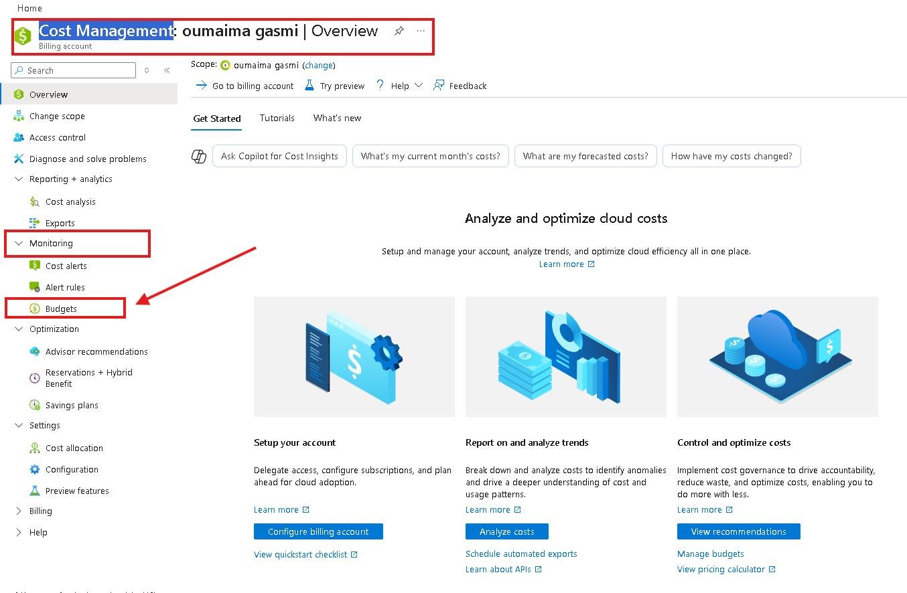| 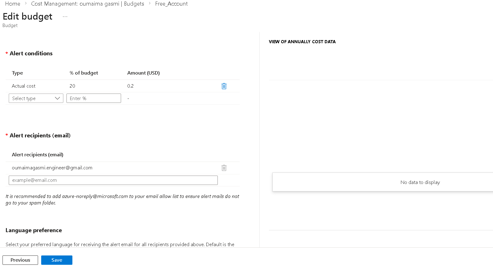 |

* **VS Code Extensions:** Ensure the **Azure** and **Databricks** extensions are installed.


---

## 🛠️ Step 1: Azure Environment Setup

### 1. Resource Group Creation
Create a Resource Group named `Databricks_project1` to act as the container for all lab resources.

| Action | Visual Reference |
| :--- | :--- |
| **Defining the Group** |  |
| **Success Confirmation** |  |

---

### 2. Storage Configuration (ADLS Gen2)
The **Storage Account** serves as the landing zone for our raw data.

1. **Search Marketplace:** Search for "Storage account" and click **Create**.
2. **Basics:** Link it to your `Databricks_project1` resource group.
3. **Advanced:** 🔑 **Enable hierarchical namespace** to activate Data Lake Gen2.

| Step | Visual Reference |
| :--- | :--- |
| **Marketplace** | 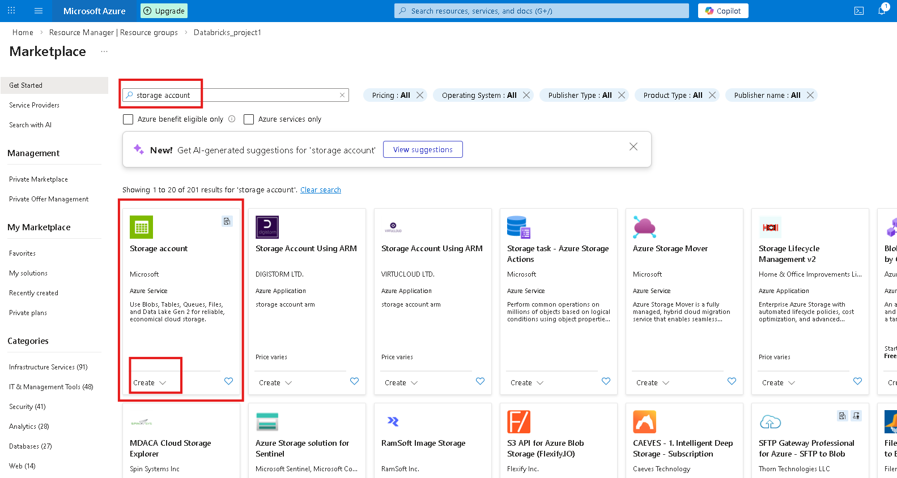 |
| **Networking** | 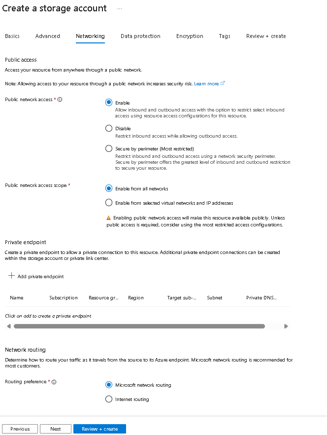 |
| **ADLS Gen2 Enable** | 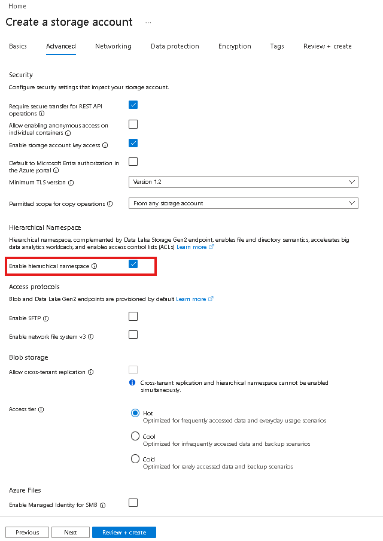 |

---

### 3. Data Lake Ingestion Structure
Now we prepare the specific folders where our raw files will be stored.

#### **A. Create a Container**
Create a container named `source`. This will hold all our incoming raw data.

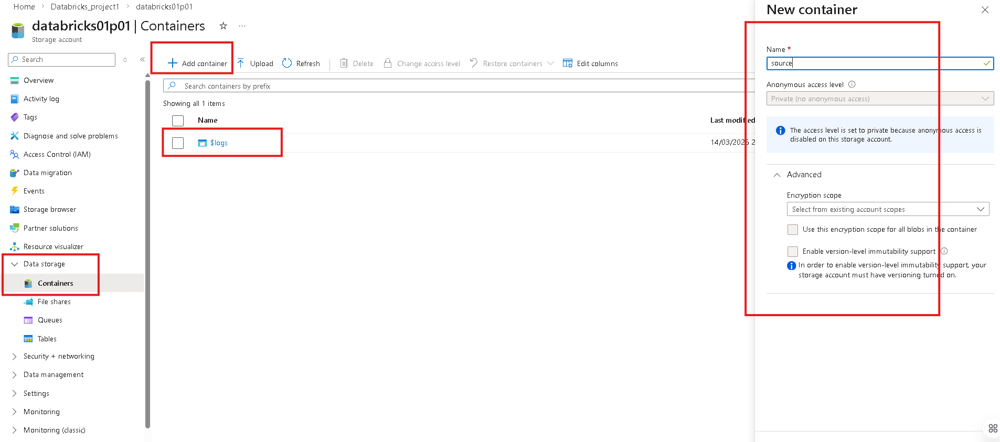

#### **B. Create Directories & Upload Data**
Inside the `source` container, create a directory called `orders` and upload your raw CSV/JSON files.

| Action | Visual Reference |
| :--- | :--- |
| **Add Directory** | 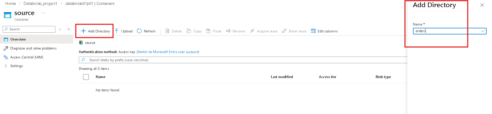 |
| **Upload Files** | 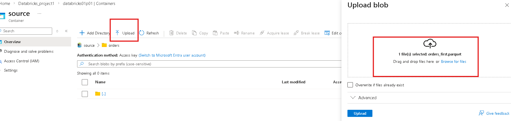 |
| **Final View** | 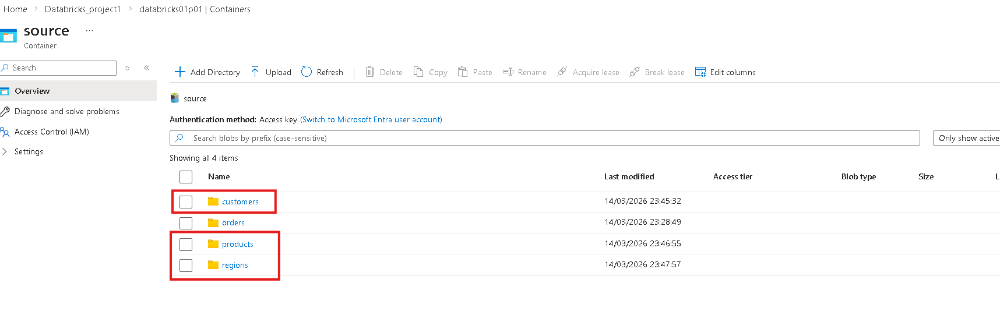 |

---

### 4. Medallion Architecture Folders
To implement a structured ETL pipeline, we create containers for each stage of the **Medallion Architecture**. 

1. Navigate to your Storage Account -> **Containers**.
2. Create the following containers:
   * `bronze`: To store raw data as Delta tables.
   * `silver`: To store filtered and cleaned data.
   * `gold`: To store business-level aggregates for reporting.

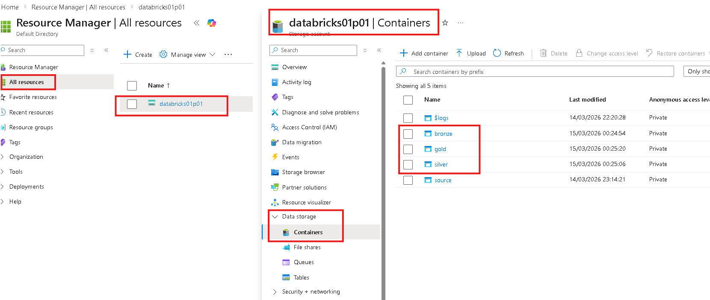

> [!IMPORTANT]
> **Current Status:** At this stage, the `bronze`, `silver`, and `gold` containers are **empty**. They will be populated automatically by our Databricks notebooks in the upcoming steps. Only the `source` container contains the initial raw files.

---

## 🛠️ Step 2: Databricks Environment Setup

Now that our "Data Lake" storage is structured, we must set up the compute power to process it.

### 1. Launching the Workspace
1. Search for **Azure Databricks** in the Azure Portal.
2. Create a new workspace in your `Databricks_project1` resource group using the following configuration:

| Configuration Tab | Description | Visual Reference |
| :--- | :--- | :--- |
| **Basics** | Set Subscription, Resource Group, and Workspace name. | 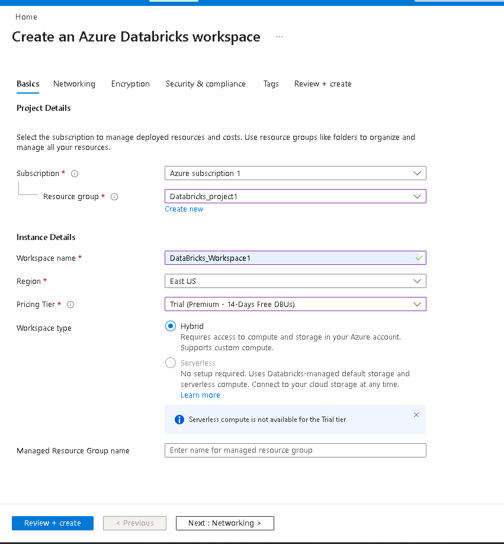 |
| **Networking** | Configure VNet and Connectivity settings. | 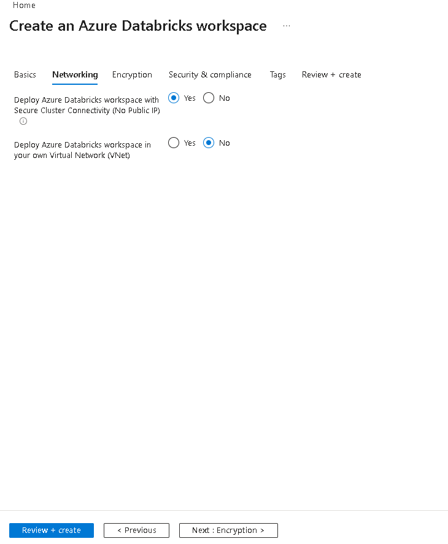 |
| **Encryption** | Standard managed encryption settings. | 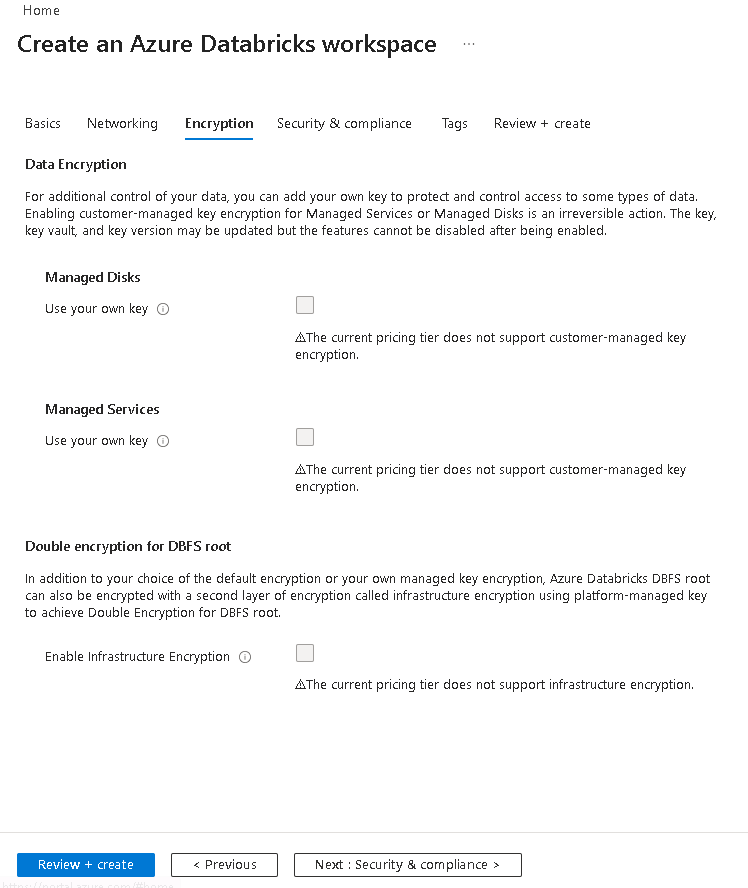 |
| **Security** | Enhanced security and compliance options. | 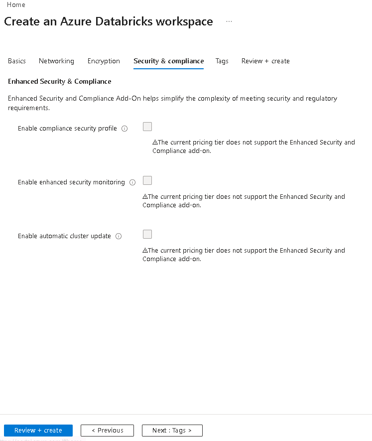 |

3. Once the deployment is complete, click **Launch Workspace**.

### 2. Creating the Cluster
In the Databricks UI:
* Go to **Compute** -> **Create Cluster**.
* Select **Single Node** (to minimize costs).
* **Crucial:** Set **Auto-Termination** to 20 minutes.

### 3. Granting Permissions
To allow Databricks to write into the `bronze`, `silver`, and `gold` folders, you must go to the **Storage Account IAM** settings and assign your Databricks identity the **Storage Blob Data Contributor** role.


---

## ⚠️ Troubleshooting: Git Remote Sync
If you encounter a `Not Found` error during your first push, verify your remote URL:

```bash
git remote set-url origin [https://github.com/MomoGasmi/End-to-End-Data-Engineering-Incremental-ETL-Lab-with-Azure-Databricks-.git](https://github.com/MomoGasmi/End-to-End-Data-Engineering-Incremental-ETL-Lab-with-Azure-Databricks-.git)
git pull origin main --rebase
