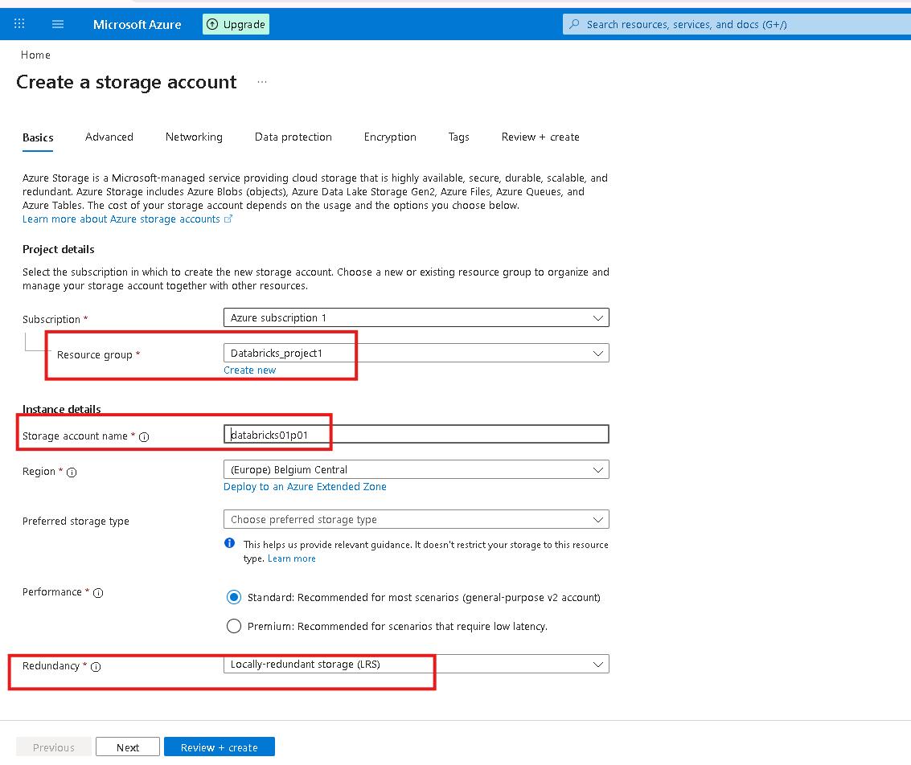
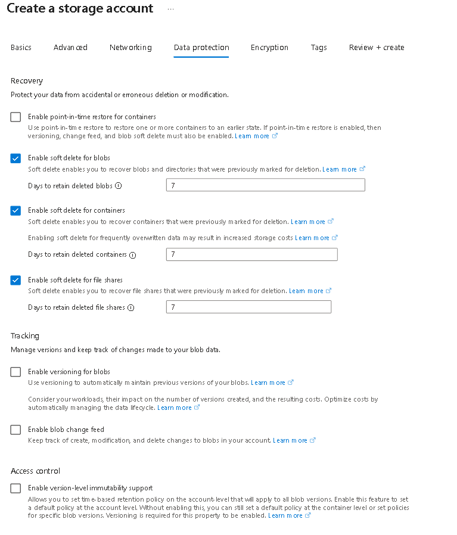
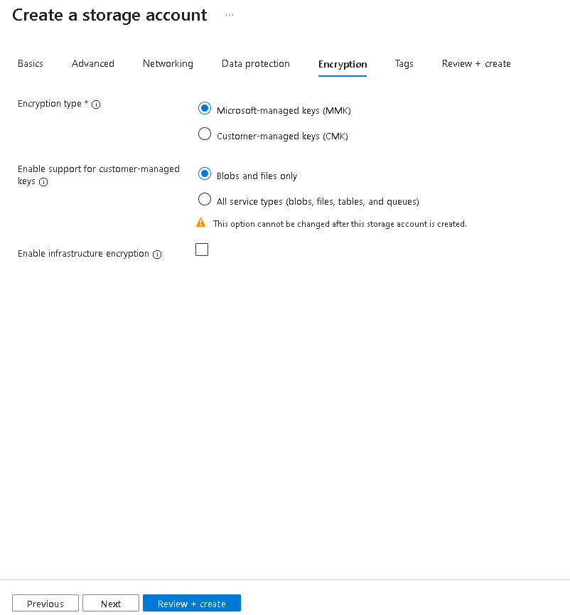
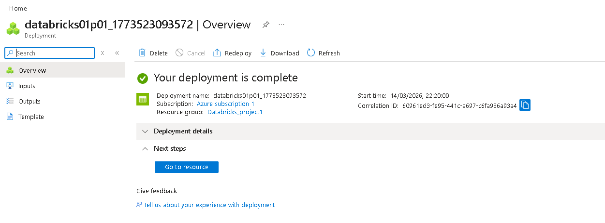

# 🚀 End-to-End Data Engineering: Incremental ETL Lab with Azure Databricks
---
## 🏗️ Project Architecture
This diagram illustrates the end-to-end data pipeline from source ingestion to final reporting.

---

## 📋 Prerequisites
Ensure you have the following ready before starting:
* **Azure Account:** An active subscription.
* **VS Code Extensions:** Ensure the **Azure** and **Databricks** extensions are installed.
* **Workspace:** An existing Azure Databricks workspace.

---

## 🛠️ Step 1: Azure Environment Setup

### 1. Resource Group Creation
A **Resource Group** is a logical container for your Azure services. 

> [!TIP]
> **Why use them?** Think of it as a project folder. If you delete the folder (Resource Group), everything inside—clusters, storage, and databases—is deleted instantly, preventing unwanted costs.

#### **Execution**
1. Log in to the [Azure Portal](https://portal.azure.com).
2. Create a Resource Group named `Databricks_project1`.

| Action | Visual Reference |
| :--- | :--- |
| **Defining the Group** |  |
| **Success Confirmation** |  |

---

### 2. Storage Configuration (ADLS Gen2)
The **Storage Account** is the "Fuel Tank" for your Databricks "Engine." While Databricks processes the data, the Storage Account keeps it safe permanently.

#### **Step-by-Step Configuration**

| Step | Portal View |
| :--- | :--- |
| **Search Marketplace** |  |
| **Basic Settings** |  |
| **Networking** |  |
| **Data Protection** |  |

#### 🔑 The Most Important Setting
When configuring the **Advanced** tab, you **must** enable the Hierarchical Namespace.

> [!IMPORTANT]
> **Enable Hierarchical Namespace:** Checking this box transforms a standard Storage Account into **Azure Data Lake Storage (ADLS) Gen2**. This allows for folder-level security and significantly faster data processing in Databricks.

| Setting | Visual Reference |
| :--- | :--- |
| **Enable ADLS Gen2** |  |
| **Encryption** |  |

---

## ✅ Deployment Completed
Once you click **Review + Create**, your Data Lake foundation is ready.

## 🛠️ Step 2: DataBricks Environment Setup