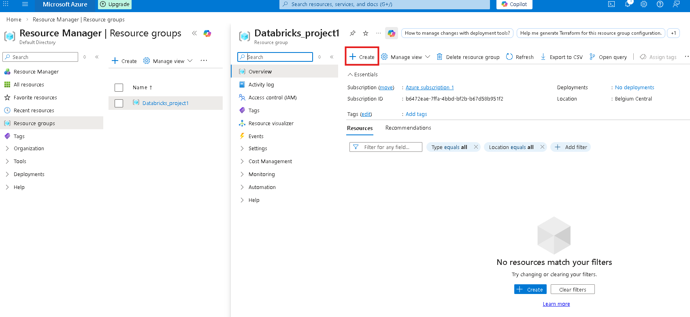

# 🚀 Azure Databricks: Incremental Data Mastery Lab

## 🏗️ Project Architecture
This diagram outlines the end-to-end flow from raw data ingestion to Power BI reporting.

---

## 📋 Prerequisites
Before you begin, ensure you have:
* An active **Azure Account**.
* **VS Code** installed with the Azure & Databricks extensions.
  
* A created **Databricks Workspace**.

---

## 🛠️ Step 1: Azure Environment Setup

### 1. Resource Group Creation
Before we deploy any services, we need a container to hold them. Think of an **Azure Resource Group** as a **logical folder** on your computer. Instead of letting your virtual machines and databases float around individually, you put them into these folders to keep things organized.

**Why we use them:**
* **Life Cycle Management:** If you delete the Resource Group, everything inside it (Databricks, storage, etc.) is deleted at once—perfect for cleaning up after a project.
* **Billing & Security:** You can track the exact cost of `Databricks_project1` and control who has permission to edit it.

#### **Execution**
Log in to the [Azure Portal](https://portal.azure.com) and create a **Resource Group** named `Databricks_project1`. 

| Action | Visual Reference |
| :--- | :--- |
| **Defining the Group** |  |
| **Successful Deployment** |  |

---

### 2. Storage Configuration
Since we are already inside the `Databricks_project1` Resource Group, any resource you create here will be automatically organized into this group.

| Action | Visual Reference |
| :--- | :--- |
| **Start Creation** |  |
| **Marketplace Search** |  |

#### **Why is this the first step?**
In a Databricks environment, the **Storage Account** acts as your **Data Lake**.

> **The Analogy:** Think of Azure Databricks as a high-performance **engine** and the Storage Account as the **fuel tank**. You can turn the engine off to save gas, but you never want to throw away the fuel!

#### **What is a Data Lake?**
A Data Lake is a "digital warehouse" that doesn't care what format your data is in:
* **Centralized Data:** It is one big bucket for everything—messy CSVs, organized Parquet files, or web-based JSON.
* **Persistent Storage:** Databricks clusters are expensive, so we turn them off when not in use. The Storage Account is **permanent**; your data stays safe even when Databricks is "sleeping."
* **Security:** Since it is in your project folder (Resource Group), you can decide exactly which users or clusters have the "keys" to the data.

#### **Execution: Deploying ADLS Gen2**
Deploy a **Storage Account** with **Hierarchical Namespace** enabled. This acts as our Bronze, Silver, and Gold storage layers.

> **⚠️ Important Setting:** > When clicking through the setup tabs, go to the **Advanced** tab, look for **"Enable hierarchical namespace,"** and **check the box**.

**Why?** Without this, Azure treats your data like a flat pile of files. With it checked, it acts like a real **file system** with folders and sub-folders. This makes Databricks run much faster because it can find files instantly. This officially turns a standard Storage Account into **Azure Data Lake Storage (ADLS) Gen2**.